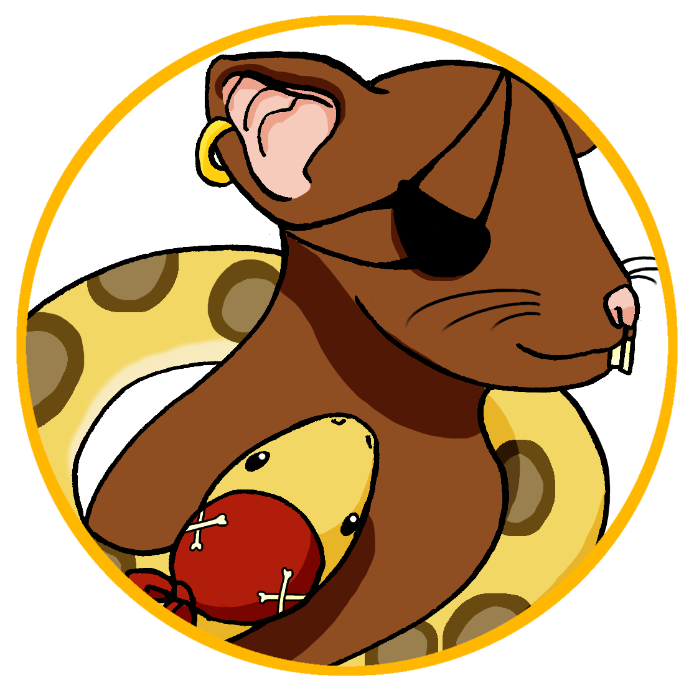
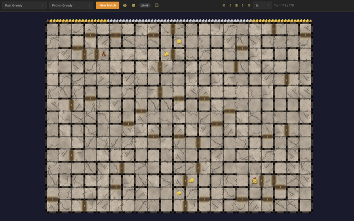

<p align="center">
  
</p>

<h1 align="center">PyRat</h1>

Welcome to pyrat-rust! This is my reimplementation of PyRat, a two-player maze game originally created for courses at IMT Atlantique ([v1 by Vincent Gripon](https://github.com/vgripon/PyRat), [v2 by Bastien Pasdeloup](https://github.com/BastienPasdeloup/PyRat)).

I started this for fun, and I hope you enjoy it too.

<p align="center">
  
</p>

## What's in this repo?

A few things, actually:

- A 🔥 _blazingly fast_ 🔥 game engine, rewritten in Rust. Handles the rules, the maze, the scoring.
- Bot development kits (SDKs) for Python and Rust: libraries that handle the server connection so you can focus on writing your bot's logic.
- A game server that runs matches between bots.
- A desktop GUI to watch it all play out.

I tried to make writing a bot as simple as I could. Here's a complete one in Python:

```python
from pyrat_sdk import Bot, Context, Direction, GameState

class MyBot(Bot):
    def think(self, state: GameState, ctx: Context) -> Direction:
        result = state.nearest_cheese()
        return result.directions[0] if result else Direction.STAY
```

[More on writing bots →](sdk/)

You can also use the engine directly for reinforcement learning or game tree search:

```python
from pyrat_engine import GameConfig
from pyrat_engine.env import PyRatEnv

env = PyRatEnv(GameConfig.classic(15, 15, 21))
obs, info = env.reset(seed=42)
obs, rewards, terms, truncs, infos = env.step(actions)
```

Or embed it as a Rust library:

```rust
use pyrat_engine::{GameConfig, Direction};

let config = GameConfig::preset("large")?;
let mut game = config.create(Some(42));
let result = game.process_turn(Direction::Right, Direction::Left);
```

[More on the engine →](engine/)

There's also a [desktop GUI](gui/) for running and watching matches. Pick two bots, configure the maze, hit start. Built with [Tauri](https://tauri.app/), requires [Node.js](https://nodejs.org/) and [pnpm](https://pnpm.io/).

## Setup

Prerequisites:

- [Rust toolchain](https://rustup.rs/)
- Python 3.10+
- [uv](https://docs.astral.sh/uv/)

```bash
git clone https://github.com/mintiti/pyrat-rust.git
cd pyrat-rust
uv sync --all-extras
```

## See it run

```bash
cargo run -p pyrat-headless -- \
  "cargo run -p pyrat-sdk --example greedy" \
  "cargo run -p pyrat-sdk --example smart_random"
```

## The game

A Rat and a Python drop into opposite corners of a maze. Cheese is scattered across the board, and both players move at the same time. Try to get more cheeses than your opponent!

First to grab more than half the cheese wins.

Full rules in the [engine README](engine/).

## Repository map

| Path                 | What it is                                                                                   |
| -------------------- | -------------------------------------------------------------------------------------------- |
| [`engine/`](engine/) | Game engine. Rust core, Python bindings, PettingZoo env                                      |
| [`sdk/`](sdk/)       | Bot development kits for [Python](sdk/python/) and [Rust](sdk/rust/), more languages to come |
| [`server/`](server/) | Match infrastructure: hosting, headless runner, wire protocol                                |
| [`gui/`](gui/)       | Desktop GUI for running and watching matches                                                 |

Run `make help` for the full command list.
